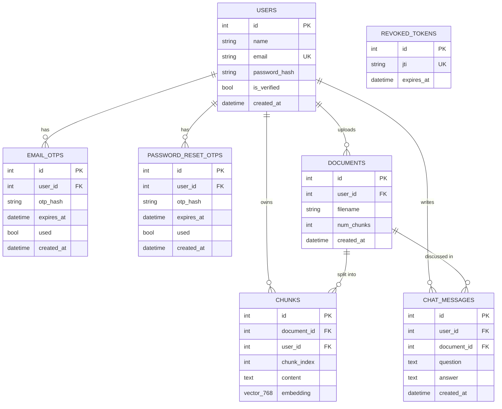

# Database schema

PostgreSQL 16 with the pgvector extension. Tables are created automatically on backend startup.

Notes:
- Passwords are stored as bcrypt hashes. OTPs are stored as SHA-256 hashes, expire after 10 minutes, and can be used once.
- All foreign keys use `ON DELETE CASCADE`: deleting a user removes their PDFs, chunks, chats and OTPs, and deleting a PDF removes its chunks and chat messages.
- Every chunk and chat message stores `user_id`, and every query filters on it, so users can only reach their own PDFs.
- `embedding` is a 768-dimension pgvector column searched with cosine distance.
- `revoked_tokens` stores the IDs of JWTs that were logged out, so they stop working immediately. It has no foreign key.